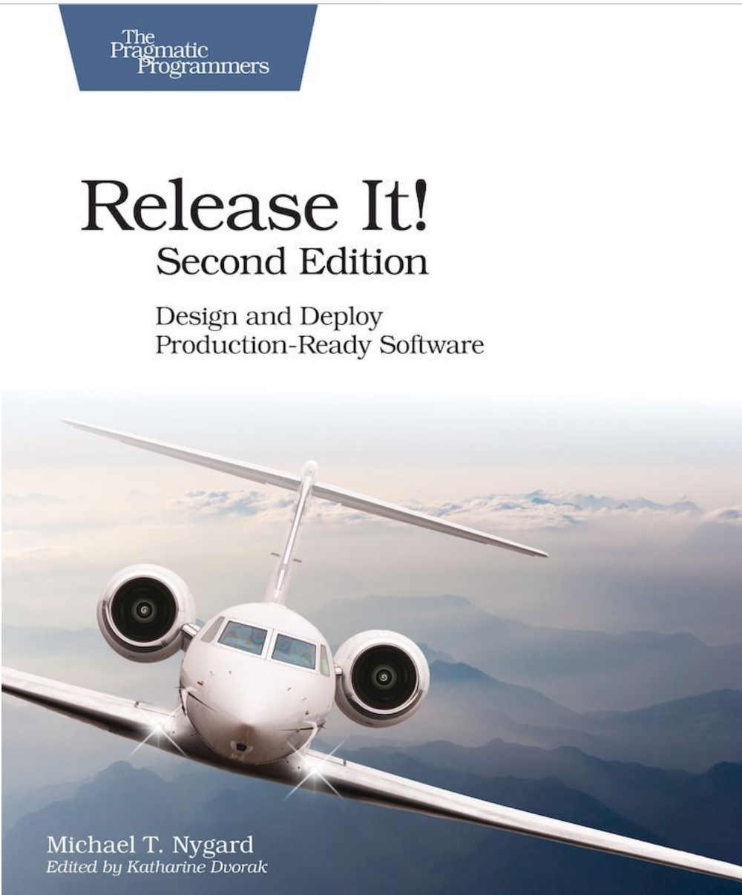

Notes on "Release It!" 
======================

|

The book is about best practices in running application in production.

**The Exception that Grounded an Airplane**

- Little error can propagete and bring to the global failure.

**Stabilize Your System**

- Defining Stability

  - Enterprise software must be cynical that expects bad things may happen and never surprised when they do.
  - The amazing thing is that developing stable system does not cost a lot, it is the same as unstable system’s cost.
  - Transaction is an abstract unit of work (Do not confuse with database transaction)
  - System is a complete interdependent set of hardware, application and services require to process transaction for users.
  - Robust system keeps processing transaction even when transient impulses, persistent stress or component failures distrust.
  - Impulse is a sudden spike(rapid shock) of the load. A tweet can cause an impulse.
  - Stress is a force applied to the system over an extended period. Getting slow responses from your component can cause a stress.
  - The definition of “long time” is deployment interval. If new code is deployed every day, that service does not have work for a year without restart (really?)

- Extending Your Lifespan.

  - Most of the glitches in the software can’t be found during the development. Because of the short lifespan of the service. If you do not create a test env that simulates your production, production becomes your test env.

- Failure Modes.

  - Sudden impulses or excessive strain can trigger a failure. The trigger and the way how it propagates with the result of the damage is called a failure mode
  - Create crackstoppers aka crumple zones to stop crack propagation.(no idea what can it be)
  - No matter what, anyway your software will have variety of failure modes. If you don’t design your failure modes, then you’ll get whatever unpredictable.
- Stop crack propagation.

  - The more the services are tight coupled, the more chance of the crack to propagate.
  - Use timeouts, do not let service to be intimately close with each other
- Chain of failure

  - Everything starts from a very little issue.
  - Fault - a condition that creates an incorrect state
  - Error - incorrect behaviour because of fault.
  - Failure - unresponsive system
  - Triggering fault opens the crack. Fault become errors, and errors provoke failures. Thats how the crack propagate.
  - Think about where the fault can occur. Ask questions or checklist.

**Stability Anti-patterns**

The fail of the system may cost billions of dollars to the company. Big systems fail faster than smaller, as the first one has more moving parts and failure modes.

- Integration Points

  - Can be in two types or between them:

    - Butterfly
    - Spider web

  - These points are number-on killer of systems.
  - Most of the connection based on sockets.
  - The bad thing with TCP/IP is that it can take long time to discover that you can’t connect.
  - The worst place for the packet is the recv queue.
  - A slow response is worse that no response

- Chain Reactions

  - A chain reaction occurs when an application has some defect, and as other instances in the homogenous layer, the defect will effect all of them.
  - A chain reaction in one layer can lead to cascading reaction in other layer
  - Recognize that on server down jeopardises the rest.
    - Chain reaction happens because of the death of one server makes the others pick up the slack.
  - Use bulkhead pattern

- Cascading Failures

  - A cascading failure occurs when a crack in one layer triggers a crack in a calling layer.
  - For example a database fail, if so, other services using the database can be down.
  - The most affective pattern to combat with it is to use Circuit Breaker and Timeouts
  - Stop carcks from jumping the gap
  - Scrutinize resource pools

- Users

  - Systems would work much stable If there were no users.

- Blocked threads

- Self denial attacks

  - Marketing team can bring down your system with discount offers
  - Scale your system beforehand 
  - Stress test 

- Scaling effects

  - Point-to-point communication is bad. Load must be balanced
  - Shared resources can a bottleneck 

- Unbalanced capacities

  - Other services that your service is interacting must have the same capacity. e.g: Frond end 100K, but backend or database only 10K.

**Stability patterns**

- Timeouts
- Circuit Breaker
- Bulkheads

  - Partition your large service into small independent parts so that failure of some of them does not halt whole system.
  - Choose the right granularity. Partitioning can be done in the level of threads, cores, VMs(bad idea), machines, etc.

- Ready state

  - Fiddling is handling something in wrong way. For example accidentally formatting your drive.destructively
  - Does something wrong accidentally 
  - Accessing server create opportunities to fiddling
  - Its best to keep people out of production
  - The system should be able to run at least one release cycle without human touch.
  - One can achieve “no fiddling” with immutable infrastructure
  - Anything that accumulates resources must release them at the end. In other words it must be drained at same rate.
  - Data purging
  
    - It’s a process of removing old data from database
    - This process requires human intervention 

*To be continued...*
